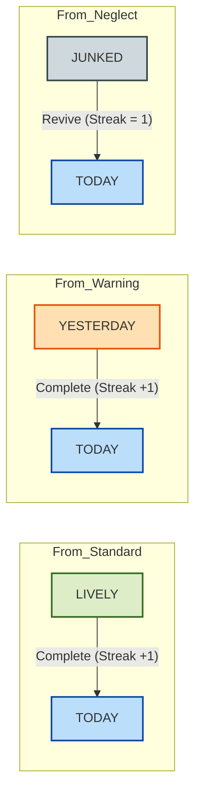
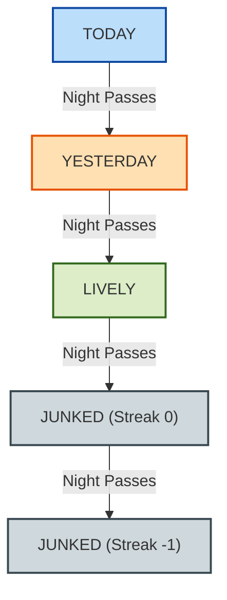
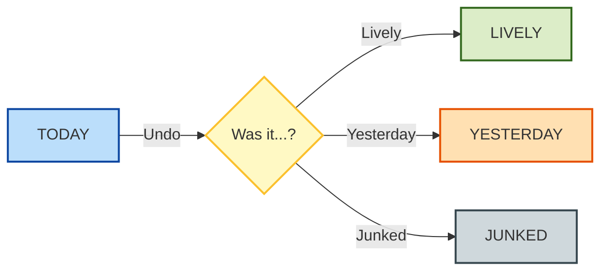
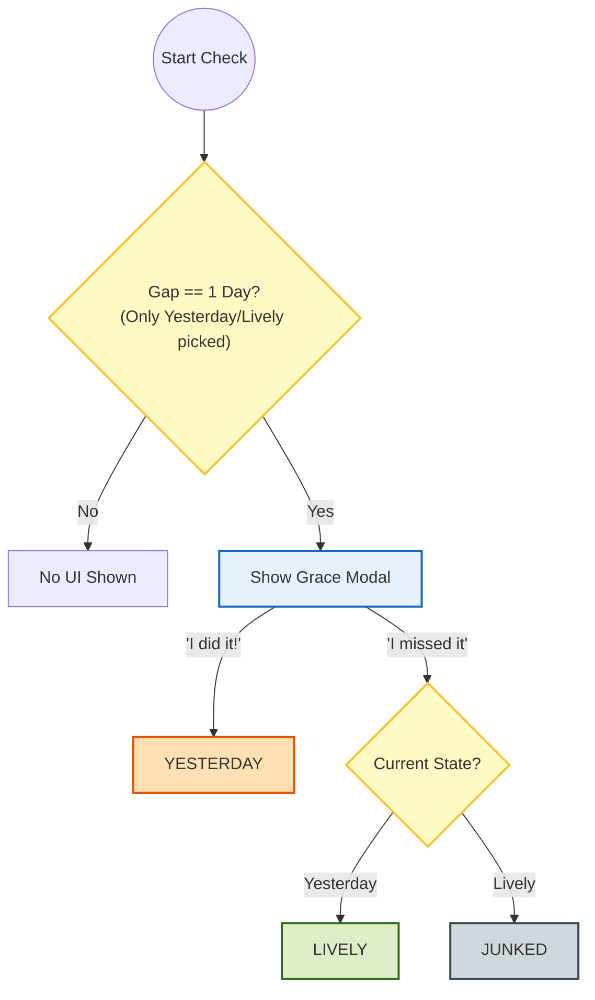
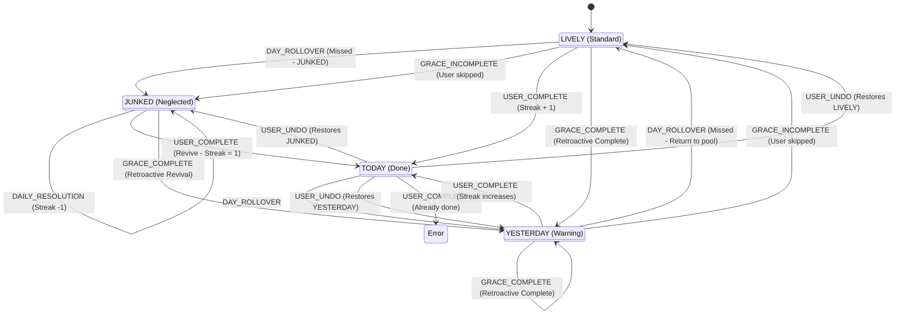

# Habit Logic & Architecture Guide

**Target Audience:** Product Managers, Developers, QA Engineers  
**Version:** 1.7  
**Status:** Approved / Handover Ready

This document is the **Source of Truth** for the Habit System in *whatcha-do.in*.

---

## 1. Core Concepts: The Two Processors

To understand how the system handles time, it's crucial to distinguish between the two main system events.

### A. DAY_ROLLOVER (The Time Traveler)

* **Purpose:** To "catch up" on history.
* **When it runs:** Inside a loop, for **every single day** the user missed since they last opened the app.
* **Logic:** It simulates what *would have happened* if the day passed.
* **Example:** If you haven't opened the app for 3 days:
    1. **Day 1 Sim:** Habit goes from `TODAY` → `YESTERDAY`.
    2. **Day 2 Sim:** Habit goes from `YESTERDAY` → `LIVELY`.
    3. **Day 3 Sim:** Habit goes from `LIVELY` → `JUNKED`.

### B. DAILY_RESOLUTION (The Present Enforcer)

* **Purpose:** To apply rules for the **current, real-time day**.
* **When it runs:** Once, immediately after the Time Travel loop finishes.
* **Logic:** It checks the final state and applies penalties for today if applicable.
* **Trigger:** Runs once per `processHabitLifecycle` call (which happens on app load/focus).
* **Example:** If a habit ends up `JUNKED` after the time travel, `DAILY_RESOLUTION` checks if you've done it *today*.
  If not, it applies the daily decay penalty (Streak -1).

---

## 2. State Transition Scenarios

### Scenario A: The "Happy Path" (User Completes Habit)

*Trigger: User clicks checkmark, marks "Done" in modal, or drags to "Today".*

### Scenario B: The "Decay Path" (Time Passes / Rollover)

*Trigger: System runs `DAY_ROLLOVER` for every day the user missed.*

### Scenario C: The "Correction Path" (Undo)

*Trigger: User clicks "Unmark" or moves habit out of "Today".*

### Scenario D: The "Grace Period" Flow

*Trigger: App opens, and the system detects the user missed yesterday (Gap = 1).*

---

## 3. Master Architecture (Combined)

---

## 4. QA Validation Guide (Detailed)

This table details the exact data transformations and side effects for every scenario.

| ID        | Scenario                                | Trigger Event      | Result State | Streak          | Longest Streak | Junked At    | Last Non-Today Streak | Last Non-Today State | Last Completed Date | Last Resolved Date       | Journal Side Effects                  |
|:----------|:----------------------------------------|:-------------------|:-------------|:----------------|:---------------|:-------------|:----------------------|:---------------------|:--------------------|:-------------------------|:--------------------------------------|
| **TC-01** | **Normal Complete** (From Lively)   | `USER_COMPLETE`    | `TODAY`      | Current + 1     | Max(Old, New)  | `null`       | (Saved Current)       | `LIVELY`             | **Today**           | *Updated at end of loop* | **Log:** "Habit Name" added (Today).  |
| **TC-02** | **Save Yesterday** (From Yesterday) | `USER_COMPLETE`    | `TODAY`      | Current + 1     | Max(Old, New)  | `null`       | (Saved Current)       | `YESTERDAY`          | **Today**           | *Updated at end of loop* | **Log:** "Habit Name" added (Today).  |
| **TC-03** | **Revive Junk** (From Junked)       | `USER_COMPLETE`    | `TODAY`      | **1**           | Unchanged      | `null`       | (Saved Current)       | `JUNKED`             | **Today**           | *Updated at end of loop* | **Log:** "Habit Name" added (Today).  |
| **TC-04** | **Undo** (From Today)               | `USER_UNDO`        | `[PREV]`     | `[PREV]`        | Unchanged      | `[RESTORED]` | Unchanged             | Unchanged            | `null`              | *Updated at end of loop* | **Remove:** Entry removed from log.   |
| **TC-05** | **Missed 1 Day** (From Today)       | `DAY_ROLLOVER`     | `YESTERDAY`  | Unchanged       | Unchanged      | `null`       | Unchanged             | Unchanged            | Unchanged           | *Updated at end of loop* | None.                                 |
| **TC-06** | **Missed 2 Days** (From Yesterday)  | `DAY_ROLLOVER`     | `LIVELY`     | Unchanged       | Unchanged      | `null`       | Unchanged             | Unchanged            | Unchanged           | *Updated at end of loop* | None.                                 |
| **TC-07** | **Neglect** (From Lively)           | `DAY_ROLLOVER`     | `JUNKED`     | **0**           | Unchanged      | **Now**      | Unchanged             | Unchanged            | Unchanged           | *Updated at end of loop* | None.                                 |
| **TC-08** | **Deep Neglect** (From Junked)      | `DAY_ROLLOVER`     | `JUNKED`     | **Current - 1** | Unchanged      | Unchanged    | Unchanged             | Unchanged            | Unchanged           | *Updated at end of loop* | None.                                 |
| **TC-09** | **Grace: Did it** (From Yesterday)  | `GRACE_COMPLETE`   | `YESTERDAY`  | Current + 1     | Max(Old, New)  | `null`       | (Saved Current)       | `YESTERDAY`          | **Yesterday**       | *Updated at end of loop* | **Log:** Entry added for *Yesterday*. |
| **TC-10** | **Grace: Missed** (From Yesterday)  | `GRACE_INCOMPLETE` | `LIVELY`     | Unchanged       | Unchanged      | `null`       | Unchanged             | Unchanged            | Unchanged           | *Updated at end of loop* | None.                                 |
| **TC-11** | **Grace: Missed** (From Lively)     | `GRACE_INCOMPLETE` | `JUNKED`     | **0**           | Unchanged      | **Now**      | Unchanged             | Unchanged            | Unchanged           | *Updated at end of loop* | None.                                 |
| **TC-12** | **Grace: Did it** (From Lively)     | `GRACE_COMPLETE`   | `YESTERDAY`  | Current + 1     | Max(Old, New)  | `null`       | (Saved Current)       | `LIVELY`             | **Yesterday**       | *Updated at end of loop* | **Log:** Entry added for *Yesterday*. |
| **TC-13** | **Grace: Did it** (From Junked)     | `GRACE_COMPLETE`   | `YESTERDAY`  | **1**           | Unchanged      | `null`       | (Saved Current)       | `JUNKED`             | **Yesterday**       | *Updated at end of loop* | **Log:** Entry added for *Yesterday*. |

---

## 5. Technical Implementation (Triggers)

* **USER_COMPLETE**: `HabitCompletionsModal` -> `onConfirm` -> `completeHabit` (`habitLifecycle.ts`)
* **USER_UNDO**: `UnmarkConfirmationModal` -> `onConfirm` -> `unmarkHabit` (`habitLifecycle.ts`)
* **GRACE_INCOMPLETE**: `GracePeriodScreen` -> "Skip" (`habitLifecycle.ts`)
* **GRACE_COMPLETE**: `GracePeriodScreen` -> "I did it" (`habitLifecycle.ts`).
* **DAY_ROLLOVER**: `habitProcessor.ts` loop (System initiated).
* **DAILY_RESOLUTION**: `habitProcessor.ts` post-loop (System initiated).

